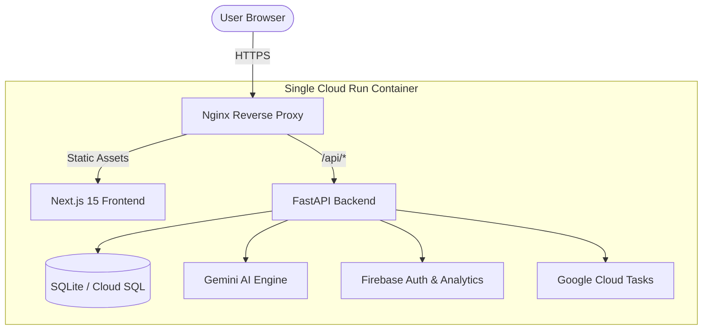

# 🗳️ MatdaanPath: India's AI-Powered Election Guide

[](https://matdaanpath-app-135105451054.asia-south1.run.app)
[](https://nextjs.org/)
[](https://fastapi.tiangolo.com/)
[](https://ai.google.dev/)
[](https://matdaanpath-app-135105451054.asia-south1.run.app/health)

**MatdaanPath** (Election Path) is a premium, AI-driven election education platform designed to empower Indian citizens for the **2026 Election Cycle**. By simplifying complex regulatory processes into intuitive, interactive journeys, we ensure every voter is ready for the upcoming Uttar Pradesh and Maharashtra elections.

🔗 **[Live Production Demo](https://matdaanpath-app-135105451054.asia-south1.run.app)**

---

## 🌟 Key Features

- 🤖 **Election Intelligence Assistant**: A context-aware chatbot powered by **Gemini 2.0 Flash**, trained on official ECI guidelines to answer registration and voting queries in real-time.
- 📅 **2026 Election Journey**: An interactive, multi-stage timeline covering the **UP Assembly By-Elections** and **Maharashtra Local Body Elections 2026**.
- ⚖️ **Dynamic Eligibility Engine**: Instant validation of voting rights using a robust rules-based system.
- 📍 **Smart Deadlines**: Stay ahead with a filtered view of upcoming registration and polling dates, localized by region.
- 🛡️ **Reliability Dashboard**: A live "Google Services" panel monitoring the health of Gemini, Firebase, and Cloud Task integrations.
- ✨ **Premium Glassmorphism UX**: A state-of-the-art interface built for visual excellence and mobile responsiveness.

---

## 🏗️ Unified Cloud Architecture

MatdaanPath is engineered as a **Modular Monolith in a Box**, deploying as a single container to Google Cloud Run for maximum efficiency.



---

## 🛠️ Technology Stack

### **Frontend Excellence**
- **Framework**: Next.js 15 (App Router)
- **Styling**: Vanilla CSS with curated Harmonious Palettes
- **Animations**: Framer Motion for smooth state transitions
- **Infrastructure**: Firebase SDK for Analytics & User Insights

### **Backend Resilience**
- **Core**: FastAPI (Python 3.11)
- **ORM**: SQLModel with Alembic migrations
- **AI**: Google GenAI SDK (Gemini 2.0 Flash Lite)
- **Observability**: Structured Cloud Logging & Error Reporting

---

## 🚀 Local Development

The project includes a suite of PowerShell tools to ensure a smooth "one-click" developer experience.

### **Quick Start**
```powershell
# 1. Clone and enter the project
git clone https://github.com/Harshitagarwal113/MatdaanPath.git
cd MatdaanPath

# 2. Launch the entire stack (Backend + Frontend + Seed Data)
.\tools\start-local.ps1
```

### **Manual Setup**

**Backend:**
```bash
cd backend
python -m venv venv && source venv/bin/activate
pip install -r requirements.txt
alembic upgrade head
python scripts/seed_data.py
uvicorn app.main:app --reload --port 8000
```

**Frontend:**
```bash
cd frontend
npm install
npm run dev
```

---

## 📝 Configuration & Environment

### **Backend Variables (`.env`)**
| Key | Purpose |
| :--- | :--- |
| `GEMINI_API_KEY` | Access to the Gemini 2.0 AI Model |
| `GOOGLE_CLOUD_PROJECT` | GCP Project ID (Default: `matdaanpath`) |
| `DATABASE_URL` | SQLAlchemy connection string |
| `DISABLE_CLOUD_LOGGING` | Set to `true` for cleaner local terminal logs |

### **Frontend Build Args**
| Key | Purpose |
| :--- | :--- |
| `NEXT_PUBLIC_API_URL` | Base API URL (Defaults to relative `/api` for Cloud Run) |
| `NEXT_PUBLIC_FIREBASE_*` | Client-side Firebase Analytics configuration |

---

## 🛡️ Diagnostics & API

- **Liveness**: `GET /health`
- **System Health**: `GET /health/detailed` (DB stats, seeding status, service health)
- **Service Status**: `GET /api/google-services/status` (AI & Cloud readiness)

---

## 🤝 Contributing & License

Contributions are what make the open-source community such an amazing place to learn, inspire, and create. Any contributions you make are **greatly appreciated**.

1. Fork the Project
2. Create your Feature Branch (`git checkout -b feature/AmazingFeature`)
3. Commit your Changes (`git commit -m 'Add some AmazingFeature'`)
4. Push to the Branch (`git push origin feature/AmazingFeature`)
5. Open a Pull Request

---

Developed with ❤️ by **[Harshit Agarwal](https://github.com/Harshitagarwal113)**
*Empowering Democracy through Intelligence.*
