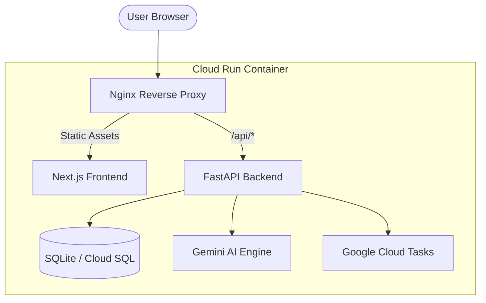

# 🗳️ MatdaanPath

[](https://matdaanpath-app-135105451054.asia-south1.run.app)
[](https://nextjs.org/)
[](https://fastapi.tiangolo.com/)
[](https://ai.google.dev/)

**MatdaanPath** is an AI-powered election education platform designed to empower Indian citizens. It simplifies complex election processes, providing clear information on registration, eligibility, and official voting steps through a modern, intuitive interface.

🔗 **[Live Demo](https://matdaanpath-app-135105451054.asia-south1.run.app)**

---

## ✨ Key Features

- 🤖 **AI Chat Assistant**: Context-aware guidance on voting queries, powered by Gemini 2.0.
- 📅 **Interactive Timeline**: A step-by-step walkthrough of the election lifecycle.
- ⚖️ **Eligibility Checker**: Instant verification of voting requirements based on real-time backend rules.
- 📖 **Election Glossary**: A comprehensive database to demystify complex terminology.
- 📍 **Region-Aware Deadlines**: Stay updated with localized schedules and national fallbacks.
- 🔔 **Smart Reminders**: Integrated with Google Cloud Tasks for timely notifications.

---

## 🏗️ Architecture

MatdaanPath follows a **Cloud Native** architecture, deployed as a unified container on Google Cloud Run.



---

## 🛠️ Tech Stack

### Frontend
- **Framework**: Next.js 15 (App Router)
- **Styling**: Vanilla CSS with modern Glassmorphism effects
- **Animations**: Framer Motion
- **Language**: TypeScript

### Backend
- **Core**: FastAPI
- **Data Access**: SQLModel (SQLAlchemy + Pydantic)
- **Migrations**: Alembic
- **Task Queue**: Google Cloud Tasks

### Infrastructure & DevOps
- **Cloud**: Google Cloud Platform (GCP)
- **Deployment**: Cloud Run
- **Observability**: Cloud Logging & Error Reporting
- **Secrets**: Google Secret Manager

---

## 🚀 Getting Started

### Prerequisites
- Node.js 20+
- Python 3.11+
- Google Cloud SDK (for deployment/cloud features)

### Quick Start (Local Development)
The easiest way to get started is using the provided PowerShell scripts in the `tools/` directory.

```powershell
# Initialize and start both Frontend & Backend
.\tools\start-local.ps1

# To stop all services
.\tools\stop-local.ps1
```

### Manual Setup

#### Backend
1. `cd backend`
2. `python -m venv venv && .\venv\Scripts\activate`
3. `pip install -r requirements.txt`
4. `alembic upgrade head`
5. `python scripts/seed_data.py`
6. `uvicorn app.main:app --reload --port 8000`

#### Frontend
1. `cd frontend`
2. `npm install`
3. `npm run dev` (Frontend runs on `http://localhost:3000`)

---

## 📝 Environment Variables

### Backend (`.env`)
| Variable | Description |
| :--- | :--- |
| `GEMINI_API_KEY` | Your Google AI API Key |
| `GOOGLE_CLOUD_PROJECT` | GCP Project ID |
| `DATABASE_URL` | Connection string (Default: `sqlite:///./matdaanpath.db`) |
| `ADMIN_API_TOKEN` | Secure token for administrative operations |

---

## 🛡️ API Diagnostics

- `GET /health`: Basic liveness check.
- `GET /health/detailed`: Deep health check (DB, counts, observability).
- `GET /api/google-services/status`: Runtime status of Gemini and Cloud integrations.

---

## ☁️ Single-URL Cloud Run Deployment

This repository includes a root `Dockerfile` that serves frontend and backend from one Cloud Run service URL:

- `nginx` serves static frontend at `/`
- `nginx` proxies backend API at `/api/*` and health at `/health*`
- FastAPI runs internally on port `8000`

### Build and deploy

```bash
gcloud builds submit --tag gcr.io/$GOOGLE_CLOUD_PROJECT/matdaanpath-app

gcloud run deploy matdaanpath-app \
  --image gcr.io/$GOOGLE_CLOUD_PROJECT/matdaanpath-app \
  --region asia-south1 \
  --platform managed \
  --allow-unauthenticated
```

### Recommended runtime environment variables

- `DATABASE_URL` (Cloud SQL/Postgres recommended for persistence)
- `GOOGLE_CLOUD_PROJECT`
- `GOOGLE_CLOUD_LOCATION=asia-south1`
- `GEMINI_API_KEY` (or Secret Manager settings)
- `RUN_DB_MIGRATIONS_ON_STARTUP=true`
- `RUN_DB_SEED_ON_STARTUP=true` (or `false` if you seed separately)
- `RUN_BOOTSTRAP=true`

### Optional frontend Firebase build args

If you want Firebase analytics baked into the static frontend at build time:

```bash
docker build -t matdaanpath-app \
  --build-arg NEXT_PUBLIC_FIREBASE_API_KEY='...' \
  --build-arg NEXT_PUBLIC_FIREBASE_AUTH_DOMAIN='...' \
  --build-arg NEXT_PUBLIC_FIREBASE_PROJECT_ID='...' \
  --build-arg NEXT_PUBLIC_FIREBASE_STORAGE_BUCKET='...' \
  --build-arg NEXT_PUBLIC_FIREBASE_MESSAGING_SENDER_ID='...' \
  --build-arg NEXT_PUBLIC_FIREBASE_APP_ID='...' \
  --build-arg NEXT_PUBLIC_FIREBASE_MEASUREMENT_ID='...' \
  .
```

---

## 🤝 Contributing

Contributions are welcome! Please feel free to submit a Pull Request or open an issue for feature requests.

---

Developed with ❤️ by [Harshit Agarwal](https://github.com/Harshitagarwal113)
